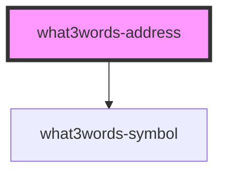

# what3words-address

<!-- Auto Generated Below -->

## Properties

| Property          | Attribute          | Description | Type      | Default                     |
| ----------------- | ------------------ | ----------- | --------- | --------------------------- |
| `iconColor`       | `icon-color`       |             | `string`  | `DEFAULTS.iconColor`        |
| `link`            | `link`             |             | `boolean` | `DEFAULTS.true`             |
| `showTooltip`     | `show-tooltip`     |             | `boolean` | `DEFAULTS.false`            |
| `size`            | `size`             |             | `number`  | `DEFAULTS.addressSize`      |
| `target`          | `target`           |             | `string`  | `DEFAULTS.target`           |
| `textColor`       | `text-color`       |             | `string`  | `DEFAULTS.textColor`        |
| `tooltip`         | `tooltip`          |             | `boolean` | `DEFAULTS.true`             |
| `tooltipLocation` | `tooltip-location` |             | `string`  | `DEFAULTS.tooltipLocation`  |
| `words`           | `words`            |             | `string`  | `DEFAULTS.threeWordAddress` |

## Dependencies

### Depends on

- [what3words-symbol](../what3words-symbol)

### Graph

----------------------------------------------

*Built with [StencilJS](https://stenciljs.com/)*
