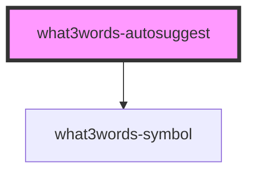

# what3words-autosuggest

<!-- Auto Generated Below -->


## Usage

### Angular

#### What3Words Autosuggest Component

##### Installation

```bash
npm install @what3words/angular-components@<PACKAGE-VERSION>
```

##### Usage

```js
import { Component } from "@angular/core";
import { RouterOutlet } from "@angular/router";

import { What3wordsAutosuggest } from "@what3words/angular-components";

@Component({
  selector: "app-root",
  imports: [RouterOutlet, What3wordsAutosuggest],
  template: `
    <what3words-autosuggest [api_key]="w3w_api_key">
      <input
        id="search-input"
        type="text"
        placeholder="Find your address"
        autocomplete="off"
      />
    </what3words-autosuggest>
    <router-outlet />
  `,
  styles: [``],
})
export class AppComponent {
  w3w_api_key = "<W3W-API-KEY>";
}
```


### Javascript

#### What3Words Autosuggest Component

##### Configuration

###### Script Parameters

When using the CDN to load this package, you can provide query string parameters to the `<script>` tag to pass the following query string parameters to the script loader once it is running:

- `key=<API_KEY>` This will provide the API Key to the SDK in the `<script>`
- `callback=<NAME>` This will provide a callback name for the SDK to call once the script loads. You should attach this function to the global window for this to actually call your script.
- `baseUrl=<URL>` The base url to pass to the SDK to call autosuggest endpoint at. (Useful for mocking in tests or pointing to a different environment.)
- `headers=<STRINGIFIED_JSON>` You can set headers that the SDK will pass to the backend autosuggest API when making requests against the API. (This is useful for tracking purposes or providing specialised agents, for example)

> Navigating to http://localhost:8080?key=API_KEY&callback=NAME&baseUrl=URL&headers={"custom-header":"foo"} will set the above script tag parameters.

####### Component Attributes

Component attributes can also be passed using script parameters. To pass attributes key/value pairs to the autosuggest component you can pass the attribute name prefixed with the component attribute prefix. The prefix defaults to `comp_` so if, for example you wanted to add the `initial-value` attribute to the component, you would provide the query paramter `comp_initial-value=<INITIAL_VALUE>`. You can change the prefix using the query parameter:

- `componentPrefix=<PREFX>` (default is `comp_`) This will change the prefix for any component attributes.
- `comp_<ATTRIBUTE>=<VALUE>` This will set the attribute `<ATTRIBUTE>` on the autosuggest component with value `<VALUE>`. (This assumes that the prefix has not been changed otherwise you should change `comp_` for the `<PREFIX>` you set it to.)

####### Custom HTML Input

If you want to have a custom HTML input being wrapped around by the `<what3words-autosuggest />` custom component tag, you must first enable this behaviour using the query parameter:

- `customInput=true`

You can also provide attributes to the input similarly to the autosuggest component attributes above by providing the attribute with the `inputPrefix` prefixing the attribute key/value pair. For example to set the `id` and `name` attributes on the custom input you would do provide the query parameters `input_id=my-id&input_name=my-form-elem`. You can also change the prefix if you wish by providing the following query paramter:

- `inputPrefix=<PREFIX>` (default is `input_`) This will change the prefix for any input attributes.
- `input_<ATTRIBUTE>=<VALUE>` This will set the attribute `<ATTRIBUTE>` on the input element with value `<VALUE>`. (This assumes that the prefix has not been changed otherwise you should change `input_` for the `<PREFIX>` you set it to.)

> :warning: **WARN**: The custom input only works if you have not disabled the autosuggest component

####### Disable Autosuggest Component

If you want to disable the Autosuggest component tag, so that the page does not add it at all and just adds the SDK which is accessible via `window.what3words` then you can provide the following query paramter to disable to the component:

- `disableAutosuggest=true`

##### Installation

###### CDN

```html
<head>
  <script
    type="module"
    defer
    src="https://cdn.what3words.com/javascript-components@<PACKAGE-VERSION>/dist/what3words/what3words.esm.js"
  ></script>
  <script
    nomodule
    defer
    src="https://cdn.what3words.com/javascript-components@<PACKAGE-VERSION>/dist/what3words/what3words.js"
  ></script>
  ...
</head>
...
```

###### NPM

```bash
npm install @what3words/javascript-components@<PACKAGE-VERSION>
```

##### Usage

```html
<body>
  <what3words-autosuggest api_key="<W3W-API-KEY>">
    <input
      id="search-input"
      type="text"
      placeholder="Find your address"
      autocomplete="off"
    />
  </what3words-autosuggest>
</body>
```


### React

#### What3Words Autosuggest Component

##### Installation

```bash
npm install @what3words/react-components@<PACKAGE-VERSION>
```

##### Usage

```jsx
import { What3wordsAutosuggest } from "@what3words/react-components";

const W3W_API_KEY = "<W3W-API-KEY>";

export default function Autosuggest() {
  return (
    <What3wordsAutosuggest api_key={API_KEY}>
      <input
        type="text"
        placeholder="Find your address"
        style={{ width: "300px" }}
        autoComplete="off"
      />
    </What3wordsAutosuggest>
  );
}
```


### Vue

#### What3Words Autosuggest Component

##### Installation

```bash
npm install @what3words/vue-components@<PACKAGE-VERSION>
```

##### Usage

```jsx
<template>
  <What3wordsAutosuggest :="$props">
    <input
      id="search-input"
      type="text"
      placeholder="Find your address"
      autocomplete="off"
    />
  </What3wordsAutosuggest>
</template>

<script lang="ts">
import {
  What3wordsAutosuggest,
} from "@what3words/vue-components";

export default {
  name: "Autosuggest",
  components: {
    What3wordsAutosuggest,
  },
  props: {
    callback: String,
    api_key: String,
    headers: String,
    base_url: String,
    name: String,
    initial_value: String,
    variant: String,
    typeahead_delay: Number,
    allow_invalid: Boolean,
    icon_visible: Boolean,
    icon_size: Number,
    icon_color: String,
    language: String,
    n_focus_results: Number,
    clip_to_country: String,
    clip_to_bounding_box: String,
    clip_to_circle: String,
    clip_to_polygon: String,
    return_coordinates: Boolean,
    onValue_changed: Function,
    onValue_valid: Function,
    onValue_invalid: Function,
    onDeselected_suggestion: Function,
    onSelected_suggestion: Function,
    onSuggestions_changed: Function,
    onCoordinates_changed: Function,
    on__hover: Function,
    on__focus: Function,
    on__blur: Function,
    on__error: Function,
  },
};
</script>

<style>
</style>
```


## Properties

| Property                        | Attribute                       | Description | Type                                                                | Default                                                            |
| ------------------------------- | ------------------------------- | ----------- | ------------------------------------------------------------------- | ------------------------------------------------------------------ |
| `api_key`                       | `api_key`                       |             | `string`                                                            | `DEFAULTS.emptyString`                                             |
| `api_version`                   | `api_version`                   |             | `ApiVersion.Version1 \| ApiVersion.Version2 \| ApiVersion.Version3` | `ApiVersion.Version3`                                              |
| `autosuggest_focus`             | `autosuggest_focus`             |             | `string`                                                            | `DEFAULTS.emptyString`                                             |
| `base_url`                      | `base_url`                      |             | `string`                                                            | `sdk.api.clients.autosuggest["_config"].host ?? DEFAULTS.base_url` |
| `callback`                      | `callback`                      |             | `string`                                                            | `DEFAULTS.emptyString`                                             |
| `clip_to_bounding_box`          | `clip_to_bounding_box`          |             | `string`                                                            | `DEFAULTS.emptyString`                                             |
| `clip_to_circle`                | `clip_to_circle`                |             | `string`                                                            | `DEFAULTS.emptyString`                                             |
| `clip_to_country`               | `clip_to_country`               |             | `string`                                                            | `DEFAULTS.emptyString`                                             |
| `clip_to_polygon`               | `clip_to_polygon`               |             | `string`                                                            | `DEFAULTS.emptyString`                                             |
| `headers`                       | `headers`                       |             | `string`                                                            | `DEFAULTS.headers`                                                 |
| `initial_value`                 | `initial_value`                 |             | `string`                                                            | `DEFAULTS.emptyString`                                             |
| `invalid_address_error_message` | `invalid_address_error_message` |             | `null \| string`                                                    | `DEFAULTS.null`                                                    |
| `language`                      | `language`                      |             | `string \| undefined`                                               | `undefined`                                                        |
| `n_focus_results`               | `n_focus_results`               |             | `number \| undefined`                                               | `undefined`                                                        |
| `name`                          | `name`                          |             | `string`                                                            | `DEFAULTS.name`                                                    |
| `options`                       | `options`                       |             | `CustomOption[]`                                                    | `[]`                                                               |
| `return_coordinates`            | `return_coordinates`            |             | `boolean`                                                           | `DEFAULTS.returnCoordinates`                                       |
| `strict`                        | `strict`                        |             | `boolean`                                                           | `DEFAULTS.true`                                                    |
| `typeahead_delay`               | `typeahead_delay`               |             | `number`                                                            | `DEFAULTS.typeaheadDelay`                                          |
| `variant`                       | `variant`                       |             | `Variant.DEFAULT \| Variant.INHERIT`                                | `DEFAULTS.variant`                                                 |


## Events

| Event                    | Description | Type                              |
| ------------------------ | ----------- | --------------------------------- |
| `__blur`                 |             | `CustomEvent<void>`               |
| `__error`                |             | `CustomEvent<{ error: Error; }>`  |
| `__focus`                |             | `CustomEvent<void>`               |
| `__hover`                |             | `CustomEvent<SuggestionPayload>`  |
| `coordinates_changed`    |             | `CustomEvent<CoordinatesPayload>` |
| `deselected_suggestion`  |             | `CustomEvent<SuggestionPayload>`  |
| `selected_custom_option` |             | `CustomEvent<CustomOption>`       |
| `selected_suggestion`    |             | `CustomEvent<SuggestionPayload>`  |
| `suggestions_changed`    |             | `CustomEvent<SuggestionsPayload>` |
| `suggestions_not_found`  |             | `CustomEvent<void>`               |
| `value_changed`          |             | `CustomEvent<InputValuePayload>`  |
| `value_invalid`          |             | `CustomEvent<InputValuePayload>`  |
| `value_valid`            |             | `CustomEvent<InputValuePayload>`  |


## Slots

| Slot                     | Description                                         |
| ------------------------ | --------------------------------------------------- |
| `"{ HTMLInputElement }"` | Optional input to override the default slot content |


## Dependencies

### Depends on

- [what3words-symbol](../what3words-symbol)

### Graph


----------------------------------------------

*Built with [StencilJS](https://stenciljs.com/)*
