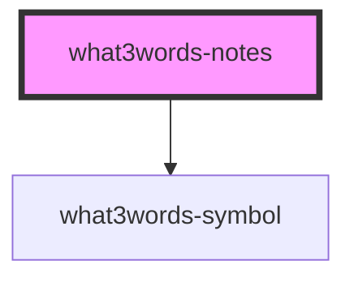

# what3words-notes

<!-- Auto Generated Below -->


## Usage

### Angular

#### What3Words Notes Component

##### Installation

```bash
npm install @what3words/angular-components@<PACKAGE-VERSION>
```

##### Usage

```js
import { Component } from "@angular/core";
import { RouterOutlet } from "@angular/router";

import { What3wordsAutosuggest } from "@what3words/angular-components";

@Component({
  selector: "app-root",
  imports: [RouterOutlet, What3wordsAutosuggest],
  template: `
    <what3words-notes [api-key]="w3w_api_key">
      <label slot="label" for="delivery-notes">Delivery Notes</label>
      <textarea
        slot="input"
        name="delivery-notes"
        title="delivery-notes"
      ><textarea/>
    </what3words-notes>
    <router-outlet />
  `,
  styles: [``],
})
export class AppComponent {
  w3w_api_key = "<W3W-API-KEY>";
}
```


### Javascript

#### What3Words Notes Component

##### Installation

###### CDN

```html
<head>
  <script
    type="module"
    defer
    src="https://cdn.what3words.com/javascript-components@<PACKAGE-VERSION>/dist/what3words/what3words.esm.js"
  ></script>
  <script
    nomodule
    defer
    src="https://cdn.what3words.com/javascript-components@<PACKAGE-VERSION>/dist/what3words/what3words.js"
  ></script>
  ...
</head>
...
```

###### NPM

```bash
npm install @what3words/javascript-components@<PACKAGE-VERSION>
```

##### Usage

###### Input Slot - Text Area Element

```html
<body>
  <what3words-notes api-key="<W3W-API-KEY>">
    <label slot="label" for="delivery-notes">Delivery Notes</label>
    <textarea
      slot="input"
      name="delivery-notes"
      placeholder="Type delivery instructions with your what3words address"
    ></textarea>
  </what3words-notes>
</body>
```

###### Input Slot - Input Element

```html
<what3words-notes api-key="<YOUR-API-KEY>">
  <label slot="label" for="delivery-notes">Delivery Notes</label>
  <input
    slot="input"
    type="text"
    name="delivery-notes"
    placeholder="Type delivery instructions with your what3words address"
    autocomplete="off"
  />
</what3words-notes>
```

###### Tooltip Slot

```html
<body>
  <what3words-notes api-key="<W3W-API-KEY>">
    <label slot="label" for="delivery-notes">Delivery Notes</label>
    <textarea
      slot="input"
      name="delivery-notes"
      placeholder="Type delivery instructions with your what3words address"
      autocomplete="off"
    ></textarea>
    <div slot="tooltip">
      <h3>Did you know?</h3>
      <p>
        You can add a
        <a
          href="https://delivery.w3w.co"
          target="_blank"
          rel="noopener noreferrer"
        >
          what3words
        </a>
        address to help our delivery partners find you first time
        <br />
        e.g. ///limit.boom.field
      </p>
    </div>
  </what3words-notes>
</body>
```


### React

#### What3Words Notes Component

##### Installation

```bash
npm install @what3words/react-components@<PACKAGE-VERSION>
```

##### Usage

```jsx
import { What3wordsAutosuggest } from "@what3words/react-components";

const W3W_API_KEY = "<W3W-API-KEY>";

export default function Notes() {
  return (
    <What3wordsNotes api-key={API_KEY}>
      <label slot="label" for="delivery-notes">
        Delivery Notes
      </label>
      <textarea
        slot="input"
        name="delivery-notes"
        placeholder="Type delivery instructions with your what3words address"
      ></textarea>
    </What3wordsNotes>
  );
}
```


### Vue

#### What3Words Notes Component

##### Installation

```bash
npm install @what3words/vue-components@<PACKAGE-VERSION>
```

##### Usage

```jsx
<template>
  <What3wordsNotes :="$props">
    <label slot="label" for="delivery-notes">
      Delivery Notes
    </label>
    <textarea
      slot="input"
      name="delivery-notes"
      placeholder="Type delivery instructions with your what3words address"
    ></textarea>
  </What3wordsNotes>
</template>

<script lang="ts">
import {
  What3wordsNotes,
} from "@what3words/vue-components";

export default {
  name: "Notes",
  components: {
    What3wordsNotes,
  },
  props: {
    addressFormat: String,
    apiKey: String,
    apiVersion: String,
    baseUrl: String,
    callback: String,
    clipToBoundingBox: String,
    clipToCircle: String,
    clipToCountry: String,
    clipToPolygon: String,
    headers: String,
    language: String,
    nFocusResults: Number,
    searchFocus: Number,
    showHintsTooltip: Boolean,
    typeaheadDelay: String,
  },
};
</script>

<style>
</style>
```


## Properties

| Property            | Attribute              | Description                                                                                                                                           | Type                                                                | Default                                                            |
| ------------------- | ---------------------- | ----------------------------------------------------------------------------------------------------------------------------------------------------- | ------------------------------------------------------------------- | ------------------------------------------------------------------ |
| `addressFormat`     | `address-format`       | The format to display the what3words address in - `slashes` - e.g. `///filled.count.soap` (default) - `url` - e.g. `https://w3w.co/filled.count.soap` | `"slashes" \| "url"`                                                | `"slashes"`                                                        |
| `apiKey`            | `api-key`              | The what3words API key to use for the what3words API requests                                                                                         | `string`                                                            | `""`                                                               |
| `apiVersion`        | `api-version`          | The API version to use for the what3words API requests                                                                                                | `ApiVersion.Version1 \| ApiVersion.Version2 \| ApiVersion.Version3` | `"v3" as ApiVersion`                                               |
| `baseUrl`           | `base-url`             | The base URL for the what3words API requests                                                                                                          | `string`                                                            | `sdk.api.clients.autosuggest["_config"].host ?? DEFAULTS.base_url` |
| `callback`          | `callback`             | The callback function to execute when the component is loaded                                                                                         | `string`                                                            | `""`                                                               |
| `clipToBoundingBox` | `clip-to-bounding-box` | Clip the results to a specific bounding box                                                                                                           | `string`                                                            | `""`                                                               |
| `clipToCircle`      | `clip-to-circle`       | Clip the results to a specific circle                                                                                                                 | `string`                                                            | `""`                                                               |
| `clipToCountry`     | `clip-to-country`      | Clip the results to a specific country                                                                                                                | `string`                                                            | `""`                                                               |
| `clipToPolygon`     | `clip-to-polygon`      | Clip the results to a specific polygon                                                                                                                | `string`                                                            | `""`                                                               |
| `headers`           | `headers`              | The headers to include in the what3words API requests                                                                                                 | `string`                                                            | `"{}"`                                                             |
| `language`          | `language`             | The language to return the results in                                                                                                                 | `string`                                                            | `""`                                                               |
| `nFocusResults`     | `n-focus-results`      | The number of results to return                                                                                                                       | `number`                                                            | `3`                                                                |
| `searchFocus`       | `search-focus`         | The focus point to prioritize results around. If not provided, the user's current location is used.                                                   | `` `${number},${number}` \| undefined ``                            | `undefined`                                                        |
| `showHintsTooltip`  | `show-hints-tooltip`   | Show the what3words hints tooltip when clicking on the what3words status icon                                                                         | `boolean`                                                           | `true`                                                             |
| `typeaheadDelay`    | `typeahead-delay`      | The delay in milliseconds to wait after the user has finished typing before making an autosuggest request                                             | `number`                                                            | `300`                                                              |


## Events

| Event                | Description                                                    | Type                                     |
| -------------------- | -------------------------------------------------------------- | ---------------------------------------- |
| `apiError`           | Emitted when a what3words API error occurs                     | `CustomEvent<{ error: Error \| null; }>` |
| `suggestionHover`    | Emitted when a suggestion is hovered over                      | `CustomEvent<SuggestionPayload>`         |
| `suggestionsChanged` | Emitted when the suggestions change                            | `CustomEvent<SuggestionsPayload>`        |
| `suggestionSelected` | Emitted when a suggestion is selected                          | `CustomEvent<SuggestionPayload>`         |
| `valueChanged`       | Emitted when the input value changes                           | `CustomEvent<InputValuePayload>`         |
| `valueInvalid`       | Emitted when the input value is not a valid what3words address | `CustomEvent<InputValuePayload>`         |
| `valueValid`         | Emitted when the input value is a valid what3words address     | `CustomEvent<InputValuePayload>`         |


## Slots

| Slot        | Description                                                                                                                                                                                                                                     |
| ----------- | ----------------------------------------------------------------------------------------------------------------------------------------------------------------------------------------------------------------------------------------------- |
| `"input"`   | The textarea or input element to get suggestions from when typing ``` <what3words-notes api-key="YOUR_API_KEY"> <textarea slot="input"></textarea> <!-- OR --> <input slot="input" type="text" /> </what3words-notes> ```                       |
| `"label"`   | The label element for the input slot element ``` <what3words-notes api-key="YOUR_API_KEY"> <label slot="label" for="delivery-notes">Delivery Notes/label> <textarea slot="input" name="delivery-notes"></textarea> </what3words-notes> ```      |
| `"tooltip"` | The tooltip content to display when the status icon is clicked ``` <what3words-notes api-key="YOUR_API_KEY"> <textarea slot="input"></textarea> <div slot="tooltip"> <h1>Custom title</h1> <p>custom content</p> </div> </what3words-notes> ``` |


## Dependencies

### Depends on

- [what3words-symbol](../what3words-symbol)

### Graph


----------------------------------------------

*Built with [StencilJS](https://stenciljs.com/)*
