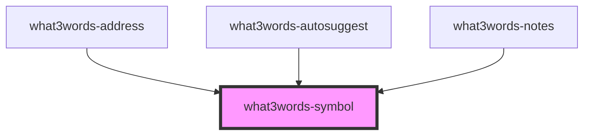

# what3words-symbol

<!-- Auto Generated Below -->

## Properties

| Property | Attribute | Description | Type     | Default               |
| -------- | --------- | ----------- | -------- | --------------------- |
| `color`  | `color`   |             | `string` | `DEFAULTS.iconColor`  |
| `size`   | `size`    |             | `number` | `DEFAULTS.symbolSize` |

## Dependencies

### Used by

 - [what3words-address](../what3words-address)
 - [what3words-autosuggest](../what3words-autosuggest)
 - [what3words-notes](../what3words-notes)

### Graph

----------------------------------------------

*Built with [StencilJS](https://stenciljs.com/)*
