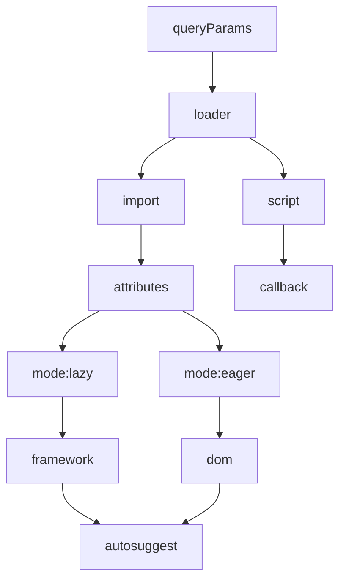

# @what3words/javascript-loader

The loader architecture is as follows.



This architecture allows for increased flexibility when integrating component configuration logic.

## Install

```sh
npm --workspace @what3words/javascript-loader install
```

## Build

```sh
npm --workspace @what3words/javascript-loader run build
```

## Usage

### Script Loaded

To use this package, you can import it as a script as follows

```html
<script
  type="module"
  src="./dist/javascript-loader/index.esm.js?callback=main"
></script>
<script
  nomodule="true"
  src="./dist/javascript-loader/index.js?callback=main"
></script>
```

The callback method must be created and attached to the window object in your application logic. An example callback implementation is shown below

```js
function main() {
  // setup what3words-autosuggest component
  window.what3words.utils.load({
    elements: ["what3words-autosuggest"],
    scriptOptions: {
      url: "https://cdn.dev.w3w.io/javascript-components",
      version: process.env.VERSION,
    },
  });

  // attach simple event listeners
  document.querySelector("what3words-autosuggest").addEventListener(
    "selected_suggestion",
    ({
      detail: {
        suggestion: { words },
      },
    }) => {
      console.log({ selectedSuggestion: words });
    }
  );
}

window.main = main;
```

# Roadmap

- Add mutation observer to sync component props to url ([1](https://stackoverflow.com/a/41425087))
- Add component tooltip configurator ([1](https://developer.mozilla.org/en-US/docs/Web/API/Popover_API))
